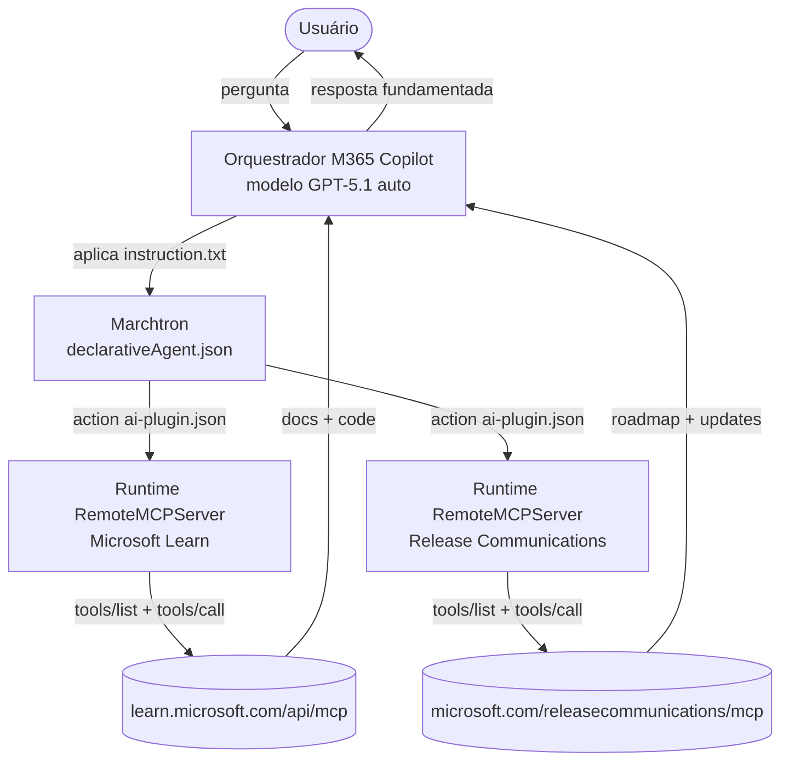

<div align="center">

# 🛰️ Marchtron — Documentação Técnica

**Arquitetura, decisões de engenharia e operação do agente declarativo.**

<p align="center">
  
</p>


</div>

---

## 📑 Índice

- [Visão de Arquitetura](#-visão-de-arquitetura)
- [Estrutura do Projeto](#-estrutura-do-projeto)
- [Componentes Principais](#-componentes-principais)
- [Conexão MCP em Detalhe](#-conexão-mcp-em-detalhe)
- [Instruções do Agente](#-instruções-do-agente)
- [Decisões de Engenharia](#-decisões-de-engenharia)
- [Limites e Restrições da Plataforma](#-limites-e-restrições-da-plataforma)
- [Fluxo de Provisionamento](#-fluxo-de-provisionamento)
- [Versionamento e Convenções](#-versionamento-e-convenções)
- [Troubleshooting](#-troubleshooting)

---

## 🏗️ Visão de Arquitetura

O Marchtron é um **declarative agent** para Microsoft 365 Copilot. Ele não traz orquestrador nem modelo próprios: declara **instruções, persona e actions**, e o Microsoft 365 Copilot fornece a orquestração e o modelo de fundação.

O conhecimento do agente vem inteiramente de **dois servidores MCP remotos**, conectados como actions. Não há base de conhecimento embarcada nem persistência — toda resposta é fundamentada em documentação oficial recuperada em tempo real.



---

## 📂 Estrutura do Projeto

```
Marchtron/
├── appPackage/
│   ├── declarativeAgent.json   # definição do agente: instruções, starters, actions
│   ├── manifest.json           # app manifest M365 (schema 1.27)
│   ├── instruction.txt         # instruções de comportamento (texto puro, < 8000 chars)
│   ├── ai-plugin.json          # action MCP: 7 functions, 2 runtimes RemoteMCPServer
│   ├── mcp-tools.json          # schema das tools do Microsoft Learn MCP
│   ├── mcp-tools-1.json        # schema das tools do Release Communications MCP
│   ├── color.png               # ícone do agente (color)
│   └── outline.png             # ícone do agente (outline)
├── .vscode/
│   └── mcp.json                # config dos servidores MCP para o toolkit
├── Assets/
│   └── Marchtron.png           # arte de marca
├── env/                        # variáveis de ambiente (gitignored)
├── evals/                      # avaliações do agente
├── m365agents.yml              # configuração do Microsoft 365 Agents Toolkit
├── README.md                   # documentação geral
├── TECHNICAL.md                # esta documentação
├── CHANGELOG.md                # histórico de versões (Keep a Changelog + semver)
├── PRIVACY.md                  # política de privacidade
├── TERMS.md                    # termos de uso
├── LICENSE.md                  # licença proprietária
└── CODEOWNERS                  # proprietário do código
```

---

## 🧩 Componentes Principais

### `declarativeAgent.json`
Núcleo do agente. Schema `v1.7`. Contém:
- `name` e `description` do agente.
- `instructions` referenciado por `$[file('instruction.txt')]` — injeta o conteúdo do arquivo como instrução em linguagem natural.
- `conversation_starters` — 4 sugestões de pergunta exibidas na tela inicial.
- `actions` — referência ao `ai-plugin.json`.

### `manifest.json`
App manifest M365 (schema `1.27`). Define `developer`, `name`, `description`, `icons`, `permissions` e o bloco `copilotAgents.declarativeAgents` que aponta para o `declarativeAgent.json`. A `version` deste arquivo é a versão do app no tenant.

### `ai-plugin.json`
Define as actions MCP. Schema de plugin `v2.4`. Contém:
- `functions` — 7 funções (3 do Learn, 4 do MRC) com nome e descrição.
- `runtimes` — 2 runtimes `RemoteMCPServer`, um por servidor, cada um com `url`, `mcp_tool_description` (apontando ao respectivo `mcp-tools*.json`), `run_for_functions` e `auth: None`.

---

## 🔌 Conexão MCP em Detalhe

O Marchtron consome dois servidores MCP públicos via transporte **Streamable HTTP**, sem autenticação.

### Microsoft Learn MCP
- **Endpoint:** `https://learn.microsoft.com/api/mcp`
- **Tools:** `microsoft_docs_search`, `microsoft_docs_fetch`, `microsoft_code_sample_search`
- **Papel:** "como funciona / como configurar" — documentação, procedimentos e exemplos de código.

### Microsoft Release Communications MCP
- **Endpoint:** `https://www.microsoft.com/releasecommunications/mcp`
- **Tools:** `get_recent_m365_roadmaps`, `get_m365_roadmap_by_id`, `get_recent_azure_updates`, `get_azure_update_by_id`
- **Papel:** "o que vem / o que mudou" — roadmap do Microsoft 365 e atualizações do Azure.

### Como a conexão foi montada
1. Servidores declarados no `.vscode/mcp.json`.
2. `Start` em cada servidor (CodeLens do toolkit) para buscar a lista de tools.
3. `ATK: Fetch action from MCP` por servidor, importando as tools para o **mesmo** `ai-plugin.json`.
4. Cada Fetch gera um arquivo de descrição de tools (`mcp-tools.json` para o Learn, `mcp-tools-1.json` para o MRC) e adiciona um runtime `RemoteMCPServer`.

---

## 📝 Instruções do Agente

O `instruction.txt` é **texto puro** (não JSON), injetado como instrução pelo `$[file()]`. Estrutura por seções:

| Seção | Função |
|---|---|
| PERSONA | Define identidade e tom |
| REGRA INEGOCIÁVEL | Grounding obrigatório via MCP antes de responder |
| FONTES CONECTADAS | Mapa das 7 tools por servidor |
| FLUXO PARA PERGUNTAS FACTUAIS | Ordem de uso: search → fetch → code_sample |
| ROTEAMENTO DE FONTES | Learn vs MRC, incluindo perguntas combinadas |
| COMPORTAMENTO DE RESPOSTA | Concisão, passo a passo, tabela, emoji |
| COMO ENCERRAR A RESPOSTA | Proibições de pitch e leitura estratégica |
| CONTEXTO DA CONVERSA | Persistência de contexto entre turnos |
| VERACIDADE | Anti-alucinação, transparência sobre lacunas |

---

## ⚙️ Decisões de Engenharia

**Por que declarative agent e não custom engine (Agent Framework).**
O Marchtron consome documentação e responde — não precisa de orquestrador próprio nem modelo customizado. O declarative agent roda no orquestrador do M365 Copilot, com integração MCP nativa e sem código compilado.

**Por que action MCP e não TypeSpec.**
No estado atual, agentes em TypeSpec não suportam MCP. O caminho de action clássico (`Add Action → Start with MCP Server`) é o único que conecta MCP em declarative agent hoje.

**Por que dois MCPs (Learn + MRC) e não Dataverse/Azure/Foundry.**
Learn cobre "como funciona" e MRC cobre "o que vem" — ambos públicos, read-only, sem autenticação, alinhados ao propósito de suporte e atualização. Dataverse/Azure/Foundry MCP exigem autenticação Entra e mudam a natureza do agente (operar dados em vez de explicar recursos); ficam como evolução futura.

**Por que `instruction.txt` em texto puro e não JSON.**
O conteúdo é consumido como instrução em linguagem natural. JSON não vira configuração estruturada — vira texto com sintaxe frágil (quebra de linha invalida o parse). Texto puro é legível, fácil de manter e sem armadilha de sintaxe.

---

## 🚧 Limites e Restrições da Plataforma

| Restrição | Valor | Implicação |
|---|---|---|
| **Tamanho do `instruction.txt`** | 8000 caracteres | Instrução precisa ser condensada; validação local não pega o estouro, só o provision |
| **Modelo do agente** | Não configurável | Herdado do M365 Copilot (GPT-5.1 auto); usuário escolhe modo no seletor do host |
| **Orquestrador** | Fechado | Comportamento só é influenciável via instrução, não controlável |
| **Verbosidade default** | Alta ("Think Deeper") | Concisão exige proibições explícitas; ainda assim pode resistir |
| **MCP em TypeSpec** | Não suportado | Action clássica é obrigatória |

---

## 🚀 Fluxo de Provisionamento

O declarative agent tem apenas a fase **provision** (não há `deploy`). As 5 etapas:

1. `teamsApp/create` — cria o app (ou reconhece o existente).
2. `teamsApp/zipAppPackage` — compila o pacote.
3. `teamsApp/validateAppPackage` — valida contra as regras do serviço.
4. `teamsApp/update` — atualiza o app no tenant.
5. `teamsApp/extendToM365` — adquire o título no Microsoft 365 (disponibiliza no Copilot).

O provision registra os IDs em `env/.env.dev.user` (gitignored). Mudanças em `instruction.txt`, `declarativeAgent.json` ou `manifest.json` só valem no agente **após novo provision**.

---

## 🔖 Versionamento e Convenções

- **Semver:** MAJOR (breaking), MINOR (nova funcionalidade), PATCH (correção/refino).
- **A `version` do `manifest.json` acompanha o semver do projeto** e é elevada a cada mudança publicável.
- **CHANGELOG:** padrão Keep a Changelog; entradas acumulam em `[Unreleased]` até o corte formal de release com tag.
- **Commits:** conventional commits (`feat`, `fix`, `chore`, `docs`, `refactor`).
- **Git no Windows:** usar encadeamento PowerShell (`;`), nunca `; true`.

---

## 🔍 Troubleshooting

| Sintoma | Causa provável | Ação |
|---|---|---|
| `TooLongInstructions` no provision | `instruction.txt` > 8000 chars | Condensar a instrução |
| CodeLens `Start`/`Fetch action` não aparece | Glitch do toolkit | Reload Window / reabrir projeto |
| Conversation starters não aparecem | Cache de sessão ou conversa já iniciada | Nova conversa; aguardar propagação |
| Validação de schema falha mas provision passa | Validador local defasado vs serviço | Confiar no provision (57 aprovado) |
| Tools MCP não importam | Servidor não iniciado | `Start` no `mcp.json` antes do Fetch |

---

<div align="center">

**Autoria: Yan Azevedo**

</div>