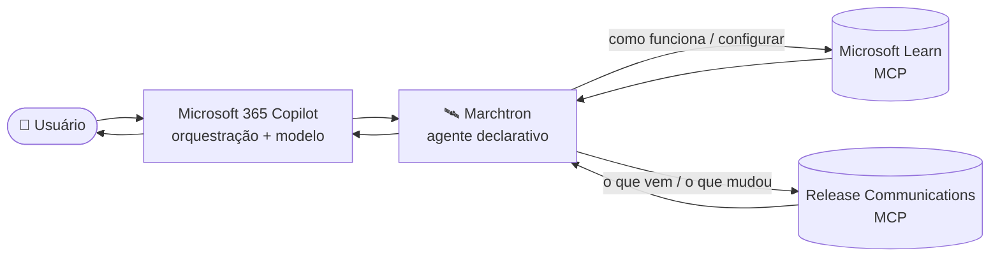

# 🛰️ Marchtron

**Assistente técnico e de atualização para o ecossistema Microsoft — esclarece dúvidas sobre desenvolvimento de agentes e automação, sempre fundamentado na documentação oficial mais recente.**

---

## 📑 Índice

- [Visão Geral](#-visão-geral)
- [O que o Marchtron faz](#-o-que-o-marchtron-faz)
- [Persona e Regra de Resposta](#-persona-e-regra-de-resposta)
- [Arquitetura](#-arquitetura)
- [Fontes Conectadas](#-fontes-conectadas)
- [Conversation Starters](#-conversation-starters)
- [Pré-requisitos](#-pré-requisitos)
- [Status](#-status)
- [Versionamento](#-versionamento)
- [Licença](#-licença)

---

## 🎯 Visão Geral

**Marchtron** é um agente declarativo para **Microsoft 365 Copilot**, criado para o dia a dia de quem desenvolve agentes e automações no ecossistema Microsoft. Ele esclarece dúvidas sobre **Copilot, Copilot M365, Copilot Studio, Power Automate, AI Builder, Dataverse** e tecnologias relacionadas — explicando como os recursos funcionam, como configurá-los, como resolver problemas e o que mudou nas plataformas.

O diferencial é a fonte: o Marchtron **consulta a documentação oficial em tempo real antes de responder**, em vez de depender de conhecimento estático. Isso garante que a orientação reflita o estado atual das tecnologias Microsoft, não uma fotografia desatualizada.

---

## 🧩 O que o Marchtron faz

- **Esclarece como recursos funcionam** — conceitos, diferenças entre opções, quando usar cada caminho.
- **Guia configuração e troubleshooting** — passo a passo numerado, baseado em procedimento oficial.
- **Traz o que é novo** — roadmap do Microsoft 365, atualizações e retirements do Azure, status de release.
- **Fundamenta em código oficial** — exemplos e samples direto da documentação Microsoft.

---

## 🧭 Persona e Regra de Resposta

**Persona:** especialista técnico Microsoft — direto, preciso e prático.

> **Regra inegociável:** toda pergunta factual é respondida consultando **primeiro** as fontes oficiais via MCP. A resposta prioriza sempre a informação **mais atualizada** da documentação oficial, **nunca conhecimento estático**. Mesmo quando há aparente certeza, o agente confirma na fonte antes de responder.

---

## 🏗️ Arquitetura

| Aspecto | Definição |
|---|---|
| **Tipo** | Agente declarativo M365 — orquestração e modelo fornecidos pelo Microsoft 365 Copilot |
| **Grounding** | Dois servidores MCP remotos, públicos e sem autenticação |
| **Conexão** | Actions via `ai-plugin.json` (runtimes `RemoteMCPServer`) |
| **Foco** | Desenvolvimento de agentes e automação Microsoft |

O Marchtron declara **persona, regra de resposta e as actions MCP**; o Microsoft 365 Copilot fornece a orquestração e o modelo. O roteamento direciona cada pergunta à fonte correta: documentação para "como funciona", roadmap para "o que vem".

---

## 🔌 Fontes Conectadas

**Microsoft Learn MCP** — `https://learn.microsoft.com/api/mcp`
*Como funciona / como configurar.*

| Tool | Função |
|---|---|
| `microsoft_docs_search` | Busca semântica na documentação oficial |
| `microsoft_docs_fetch` | Página completa de documentação em markdown |
| `microsoft_code_sample_search` | Exemplos de código oficiais |

**Microsoft Release Communications MCP** — `https://www.microsoft.com/releasecommunications/mcp`
*O que vem / o que mudou.*

| Tool | Função |
|---|---|
| `get_recent_m365_roadmaps` | Itens recentes do roadmap do Microsoft 365 |
| `get_m365_roadmap_by_id` | Item específico do roadmap M365 |
| `get_recent_azure_updates` | Atualizações e retirements do Azure |
| `get_azure_update_by_id` | Item específico do Azure |

---

## 💬 Conversation Starters

- **Novidades do Copilot Studio** — atualizações e novidades mais recentes.
- **Workflows no Copilot Studio** — o que mudou e o que está no roadmap.
- **Atualizações do Copilot M365** — recursos em rollout ou no roadmap.
- **Novidades do Copilot** — o mais recente em capacidades de chat.

---

## ✅ Pré-requisitos

- **Visual Studio Code** com o **Microsoft 365 Agents Toolkit**
- Conta **Microsoft 365** com licença **Copilot**
- Acesso aos servidores MCP do Learn e do Release Communications (públicos, sem autenticação)

---

## 📡 Status

**Operacional** — provisionado e validado em ambiente de uso pessoal.

> ⚠️ O Microsoft Learn MCP Server e o Release Communications MCP Server estão em evolução contínua; o conjunto de tools e seus schemas podem mudar.

---

## 🔖 Versionamento

Segue [Versionamento Semântico](https://semver.org/lang/pt-BR/). Todas as mudanças relevantes são documentadas no [`CHANGELOG.md`](./CHANGELOG.md).

---

## 📄 Licença

**Proprietária — Todos os Direitos Reservados.** Consulte [`LICENSE.md`](./LICENSE.md).

---

**Autoria: Yan Azevedo**

