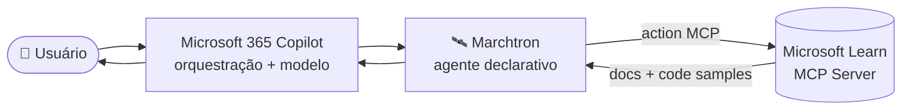

<div align="center">

# 🛰️ Marchtron

**Agente declarativo para Microsoft 365 Copilot — suporte e esclarecimento de dúvidas sobre tecnologias Microsoft, sempre fundamentado na documentação oficial mais atualizada.**


</div>

---

## 📑 Índice

- [Visão Geral](#-visão-geral)
- [Persona](#-persona)
- [Regra de Resposta](#-regra-de-resposta)
- [Arquitetura](#-arquitetura)
- [Tools do Microsoft Learn](#-tools-do-microsoft-learn)
- [Estrutura do Projeto](#-estrutura-do-projeto)
- [Pré-requisitos](#-pré-requisitos)
- [Desenvolvimento](#-desenvolvimento)
- [Status](#-status)
- [Versionamento](#-versionamento)
- [Licença](#-licença)

---

## 🎯 Visão Geral

**Marchtron** é um agente declarativo para **Microsoft 365 Copilot** que esclarece dúvidas e auxilia na resolução de problemas com recursos e tecnologias Microsoft. Toda resposta é fundamentada na **documentação oficial mais atualizada**, recuperada em tempo real através do **Microsoft Learn MCP Server**.

Diferente de um assistente que responde a partir de conhecimento estático, o Marchtron consulta a fonte oficial **antes** de responder — garantindo que a orientação reflita o estado atual das tecnologias Microsoft, não uma fotografia desatualizada.

---

## 🧭 Persona

**Especialista técnico Microsoft.** Direto, preciso e prático. Responde com base em documentação oficial, nunca em suposições. Sem enrolação, sem floreio — vai ao ponto e fundamenta.

---

## ⚖️ Regra de Resposta

> **Regra inegociável do comportamento do agente.**

Toda pergunta técnica sobre tecnologias Microsoft **DEVE** ser respondida consultando **primeiro** o Microsoft Learn MCP Server. A resposta **prioriza sempre a informação mais atualizada** da documentação oficial, **nunca conhecimento estático do modelo**. Quando relevante, a fonte oficial do Learn é **citada ou apontada**.

---

## 🏗️ Arquitetura

| Aspecto | Definição |
|---|---|
| **Tipo** | Agente declarativo M365 — orquestração e modelo fornecidos pelo Microsoft 365 Copilot |
| **Fonte de grounding** | Microsoft Learn MCP Server (`https://learn.microsoft.com/api/mcp`) |
| **Conexão** | Action via `ai-plugin.json` · runtime `RemoteMCPServer` · sem autenticação |
| **Transporte** | Streamable HTTP |



O Microsoft 365 Copilot faz a orquestração e fornece o modelo; o Marchtron declara **instruções, persona e a action do Learn**; o Learn MCP entrega a documentação oficial atualizada como contexto de resposta.

---

## 🔧 Tools do Microsoft Learn

| Tool | Função |
|---|---|
| `microsoft_docs_search` | Busca semântica na documentação oficial Microsoft / Azure |
| `microsoft_docs_fetch` | Recuperação de página completa de documentação em markdown |
| `microsoft_code_sample_search` | Busca de exemplos de código oficiais para troubleshooting |

---

## 📂 Estrutura do Projeto

```
Marchtron/
├── appPackage/
│   ├── declarativeAgent.json     # definição do agente (persona, instruções, actions)
│   ├── manifest.json             # manifest do app M365
│   ├── instruction.txt           # instruções de comportamento do agente
│   ├── ai-plugin.json            # action MCP (Learn) — funções e runtime
│   └── icons/                    # ícones color e outline
├── .vscode/
│   └── mcp.json                  # configuração do servidor MCP do Learn
├── env/                          # variáveis de ambiente (Local/Dev)
├── evals/                        # avaliações do agente
├── m365agents.yml                # configuração do Microsoft 365 Agents Toolkit
├── README.md
├── CHANGELOG.md
├── LICENSE.md
└── CODEOWNERS
```

---

## ✅ Pré-requisitos

- **Visual Studio Code** com a extensão **Microsoft 365 Agents Toolkit**
- Conta **Microsoft 365** com licença **Copilot**
- Acesso ao **Microsoft Learn MCP Server** (público, sem autenticação)

---

## 🚀 Desenvolvimento

O build é conduzido pelo **Microsoft 365 Agents Toolkit**. O agente é provisionado e testado diretamente no **Microsoft 365 Copilot**.

```bash
# Provisionar e visualizar o agente via Microsoft 365 Agents Toolkit (VS Code)
# Use os comandos do toolkit na barra lateral: Provision → Preview in Microsoft 365 Copilot
```

---

## 📡 Status

**Em desenvolvimento.**

> ⚠️ **Nota:** o Microsoft Learn MCP Server está em **public preview**. Sua implementação pode mudar antes do GA, incluindo o conjunto de tools expostas e seus schemas.

---

## 🔖 Versionamento

Este projeto segue o [Versionamento Semântico](https://semver.org/lang/pt-BR/). Todas as mudanças relevantes são documentadas no [`CHANGELOG.md`](./CHANGELOG.md).

---

## 📄 Licença

**Proprietária — Todos os Direitos Reservados.** Consulte [`LICENSE.md`](./LICENSE.md).

---

<div align="center">

**Autoria: Yan Azevedo**

</div>
